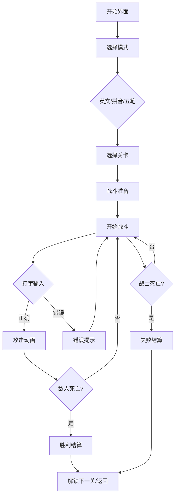

# 键盘勇者 - 产品需求文档

## 1. 产品概述

键盘勇者是一款面向打字初学者的RPG风格打字练习网页游戏。玩家扮演一名营救公主的勇敢战士，通过准确快速地打字来击败沿途的敌人，最终抵达城堡营救公主。游戏融合了角色扮演的沉浸感与打字练习的实用性，让学习过程充满趣味性。

**核心价值：**
- 通过战斗激励机制提升打字学习动力
- 三种输入模式满足不同学习阶段需求
- 渐进式难度设计帮助用户稳步提升
- 视觉反馈系统实时展示打字表现

**目标用户：**
- 打字初学者（中小学生、办公人员）
- 希望提升打字速度的用户
- 对RPG游戏感兴趣的学习者

## 2. 功能模块

### 2.1 核心游戏功能

#### 2.1.1 打字模式选择
- **英文模式**：26个字母组合，涵盖单词拼写训练
- **拼音模式**：常用汉字拼音输入练习
- **五笔模式**：五笔字根和词组练习

#### 2.1.2 关卡系统
每种模式包含5个难度递增的关卡：

| 关卡 | 英文模式 | 拼音模式 | 五笔模式 |
|------|----------|----------|----------|
| 1 | 简单单词 (cat, dog) | 单字拼音 | 五笔字根 |
| 2 | 常见单词 (apple, water) | 双字词组 | 简码字 |
| 3 | 短句 (I like music) | 三字词组 | 词组输入 |
| 4 | 中等句子 | 四字成语 | 常用句子 |
| 5 | 复杂句子/段落 | 短文段落 | 综合练习 |

#### 2.1.3 敌人设计
每个关卡对应一个独特敌人，具有不同的：
- 名称和外观
- 生命值（随难度增加）
- 攻击文字难度
- 击败奖励经验值

**敌人列表：**
1. 森林史莱姆 - 第1关
2. 洞穴蝙蝠 - 第2关
3. 沙漠蝎子 - 第3关
4. 雪山狼人 - 第4关
5. 黑龙 - 第5关（最终Boss）

### 2.2 战斗系统

#### 2.2.1 战士角色
- 初始生命值：100点
- 攻击力：每次正确输入造成 10-30 点伤害（根据速度加成）
- 防御力：减少敌人伤害的 20%
- 经验值系统：升级提升基础属性

#### 2.2.2 敌人AI
- 敌人有缓慢自动恢复生命值机制
- 敌人会定期发起攻击，造成固定伤害
- 打字错误时给予敌人反击机会

#### 2.2.3 战斗流程
1. 屏幕显示目标文字（敌人提出的挑战）
2. 玩家输入正确文字，战士发起攻击
3. 攻击动画播放
4. 敌人受伤动画
5. 敌人反击（若存在未完成的输入）
6. 循环直到一方生命值归零

### 2.3 用户界面

#### 2.3.1 主界面
- 战士角色立绘展示
- 模式选择按钮（英文/拼音/五笔）
- 当前进度显示（已通关数/总关卡数）
- 玩家等级和经验值

#### 2.3.2 关卡选择界面
- 三种模式的关卡列表
- 每关显示：关卡名称、敌人名称、难度星级、通关状态
- 锁定/解锁状态显示

#### 2.3.3 战斗界面
- 左侧：战士角色及血条
- 右侧：敌人角色及血条
- 底部：打字输入区域
- 顶部：计时器、连击计数器
- 浮动：伤害数字飘字效果

#### 2.3.4 结果界面
- 胜利/失败状态
- 战斗统计：准确率、速度、用时、伤害输出
- 经验值获得
- 升级提示（若有）
- 继续/返回按钮

### 2.4 数据统计

#### 4.4.1 实时数据
- 每分钟字数（WPM）
- 准确率百分比
- 当前连击数
- 剩余生命值

#### 4.4.2 历史记录
- 各模式历史最高WPM
- 各关卡最佳成绩
- 总练习时长
- 累计击败敌人数

## 3. 用户流程

### 3.1 主流程

### 3.2 关卡解锁规则
- 第1关默认解锁
- 击败当前关卡后解锁下一关
- 同一模式下关卡依次解锁

## 4. 视觉设计

### 4.1 设计风格
- **整体风格**：像素RPG风格 + 现代扁平化UI
- **色调**：深色背景配合明亮的角色和文字
- **氛围**：史诗冒险感，紧张刺激的战斗氛围

### 4.2 配色方案
| 用途 | 颜色代码 | 说明 |
|------|----------|------|
| 主色调 | #6366F1 | 战士/UI强调色 |
| 敌人色 | #EF4444 | 敌人/危险提示 |
| 成功色 | #22C55E | 正确输入/胜利 |
| 警告色 | #F59E0B | 错误/低血量 |
| 背景色 | #0F172A | 深蓝黑背景 |
| 文字色 | #F8FAFC | 主文字 |

### 4.3 字体选择
- **标题字体**：Press Start 2P（像素风格）
- **正文字体**：Noto Sans SC（中文优化）
- **代码/打字**：JetBrains Mono（等宽字体）

### 4.4 动画效果
- 攻击动画：战士挥剑/施法动作
- 受伤动画：角色闪烁红色
- 伤害数字：飘字上升消失
- 打字正确：绿色高亮 + 轻微缩放
- 打字错误：红色抖动 + 屏幕震动

## 5. 游戏数值设计

### 5.1 敌人属性

| 关卡 | 敌人 | 生命值 | 攻击间隔 | 伤害值 |
|------|------|--------|----------|--------|
| 1 | 森林史莱姆 | 50 | 8秒 | 5 |
| 2 | 洞穴蝙蝠 | 80 | 7秒 | 8 |
| 3 | 沙漠蝎子 | 120 | 6秒 | 12 |
| 4 | 雪山狼人 | 180 | 5秒 | 15 |
| 5 | 黑龙 | 300 | 4秒 | 20 |

### 5.2 奖励机制
- 每关基础经验：100点
- 准确率加成：额外经验 = 基础经验 × (准确率 - 70%)
- 速度加成：完成时间 < 平均时间，额外获得50点
- 完美通关（100%准确率）：额外获得100点

### 5.3 升级系统
- 每次升级所需经验：100 × 当前等级
- 每级提升：生命值+10，攻击力+5

## 6. 技术需求

### 6.1 前端技术
- React 18 + TypeScript
- Vite 构建工具
- TailwindCSS 样式
- CSS 动画（无额外动画库依赖）

### 6.2 响应式设计
- 桌面端优先设计
- 最小支持宽度：1024px
- 移动端提示使用桌面设备

### 6.3 数据存储
- LocalStorage 保存用户进度
- 无需后端服务器
