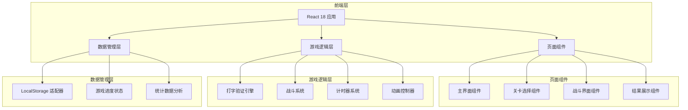

# 键盘勇者 - 技术架构文档

## 1. 架构设计



## 2. 技术选型

| 技术 | 版本 | 用途 |
|------|------|------|
| React | 18.x | UI框架 |
| TypeScript | 5.x | 类型安全 |
| Vite | 5.x | 构建工具 |
| TailwindCSS | 3.x | 样式框架 |
| CSS Animations | - | 动画效果 |

## 3. 项目结构

```
/workspace
├── index.html
├── package.json
├── vite.config.ts
├── tsconfig.json
├── tailwind.config.js
├── postcss.config.js
├── src/
│   ├── main.tsx              # 入口文件
│   ├── App.tsx               # 根组件
│   ├── index.css             # 全局样式
│   ├── types/
│   │   └── game.ts           # 类型定义
│   ├── data/
│   │   ├── levels.ts         # 关卡数据
│   │   ├── enemies.ts        # 敌人数据
│   │   └── words.ts          # 打字词库
│   ├── hooks/
│   │   ├── useGameState.ts   # 游戏状态管理
│   │   ├── useTyping.ts      # 打字逻辑
│   │   └── useBattle.ts      # 战斗逻辑
│   ├── components/
│   │   ├── Home/
│   │   │   └── Home.tsx      # 主界面
│   │   ├── LevelSelect/
│   │   │   └── LevelSelect.tsx  # 关卡选择
│   │   ├── Battle/
│   │   │   ├── Battle.tsx    # 战斗主界面
│   │   │   ├── Warrior.tsx   # 战士角色
│   │   │   ├── Enemy.tsx     # 敌人角色
│   │   │   ├── TypingArea.tsx # 打字区域
│   │   │   └── BattleUI.tsx  # 战斗UI
│   │   ├── Result/
│   │   │   └── Result.tsx     # 结果界面
│   │   └── common/
│   │       ├── Button.tsx    # 按钮组件
│   │       ├── ProgressBar.tsx # 进度条
│   │       └── DamageNumber.tsx # 伤害数字
│   └── utils/
│       ├── storage.ts        # 本地存储
│       └── gameConfig.ts     # 游戏配置
```

## 4. 路由定义

| 路由 | 组件 | 说明 |
|------|------|------|
| / | Home | 主界面/模式选择 |
| /select/:mode | LevelSelect | 关卡选择 |
| /battle/:mode/:level | Battle | 战斗界面 |
| /result | Result | 战斗结果 |

## 5. 核心数据模型

### 5.1 游戏状态类型

```typescript
interface GameState {
  player: Player;
  currentMode: 'english' | 'pinyin' | 'wubi';
  currentLevel: number;
  battleState: BattleState | null;
  unlockedLevels: Record<string, number[]>;
}

interface Player {
  level: number;
  exp: number;
  maxHp: number;
  currentHp: number;
  attack: number;
}

interface BattleState {
  playerHp: number;
  enemyHp: number;
  enemyMaxHp: number;
  currentWord: string;
  typedText: string;
  startTime: number;
  mistakes: number;
  totalChars: number;
  combo: number;
  maxCombo: number;
  enemyAttacking: boolean;
  isPlayerTurn: boolean;
}
```

### 5.2 关卡数据结构

```typescript
interface Level {
  id: number;
  name: string;
  enemy: Enemy;
  words: string[];
  averageTime: number;
}

interface Enemy {
  id: string;
  name: string;
  maxHp: number;
  damage: number;
  attackInterval: number;
  description: string;
}
```

## 6. 核心游戏逻辑

### 6.1 打字验证流程

```
用户输入字符
    ↓
比对当前目标字符
    ↓
┌────┴────┐
↓          ↓
正确       错误
↓          ↓
更新已输入    显示错误效果
触发攻击      减少连击
增加伤害值    敌人反击机会
```

### 6.2 伤害计算

```typescript
function calculateDamage(baseDamage: number, combo: number): number {
  const comboBonus = Math.floor(combo / 5) * 2;
  return baseDamage + comboBonus;
}
```

### 6.3 经验值计算

```typescript
function calculateExp(
  baseExp: number,
  accuracy: number,
  timeUsed: number,
  averageTime: number
): number {
  let exp = baseExp;
  if (accuracy >= 70) {
    exp += baseExp * ((accuracy - 70) / 100);
  }
  if (timeUsed < averageTime) {
    exp += 50;
  }
  if (accuracy === 100) {
    exp += 100;
  }
  return Math.floor(exp);
}
```

## 7. 敌人攻击AI

```typescript
// 敌人攻击定时器逻辑
useEffect(() => {
  if (!battleState || battleState.enemyHp <= 0) return;
  
  const timer = setInterval(() => {
    if (!battleState.enemyAttacking) {
      triggerEnemyAttack();
    }
  }, currentEnemy.attackInterval * 1000);
  
  return () => clearInterval(timer);
}, [battleState?.enemyHp, currentEnemy]);
```

## 8. 本地存储结构

```typescript
interface StorageData {
  player: Player;
  unlockedLevels: Record<string, number[]>;
  statistics: {
    totalPlayTime: number;
    enemiesDefeated: number;
    bestWpm: Record<string, number>;
    bestAccuracy: Record<string, number>;
  };
}

// LocalStorage Key: 'keyboard-hero-save'
```

## 9. 样式架构

### 9.1 TailwindCSS 配置
- 使用自定义颜色变量
- 深色主题为主
- 响应式断点：md(768px), lg(1024px)

### 9.2 动画类名约定
| 类名 | 用途 |
|------|------|
| animate-attack | 攻击动画 |
| animate-hurt | 受伤动画 |
| animate-float-up | 飘字上升 |
| animate-shake | 错误抖动 |
| animate-pulse-glow | 脉冲发光 |

## 10. 打字词库设计

### 10.1 英文词库（按难度）
- Level 1: 3-4字母单词 (cat, dog, sun)
- Level 2: 5-6字母单词 (apple, water, happy)
- Level 3: 短句 (I am happy)
- Level 4: 中等句子 (The sky is blue)
- Level 5: 复杂句子 (Today is a beautiful day)

### 10.2 拼音词库（按难度）
- Level 1: 单字拼音 (wo, ni, ta)
- Level 2: 双字词 (zhongguo, beijing)
- Level 3: 三字词 (laoshig)
- Level 4: 四字成语 (fengguo三代)
- Level 5: 短文段落

### 10.3 五笔词库（按难度）
- Level 1: 字根 (金木水火)
- Level 2: 简码字 (中国 gkgl)
- Level 3: 词组 (高兴 vygg)
- Level 4: 常用句
- Level 5: 综合练习
